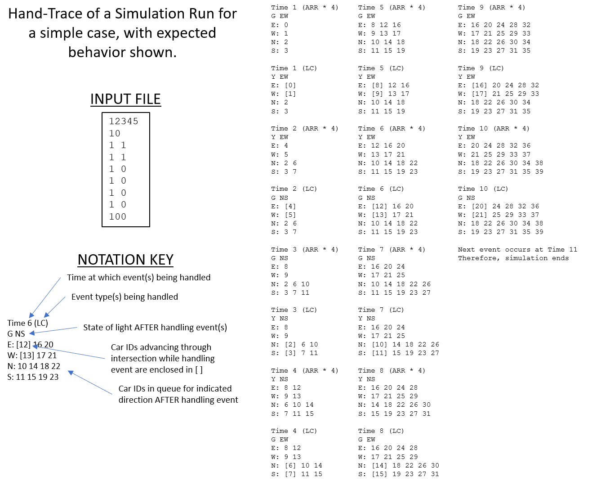
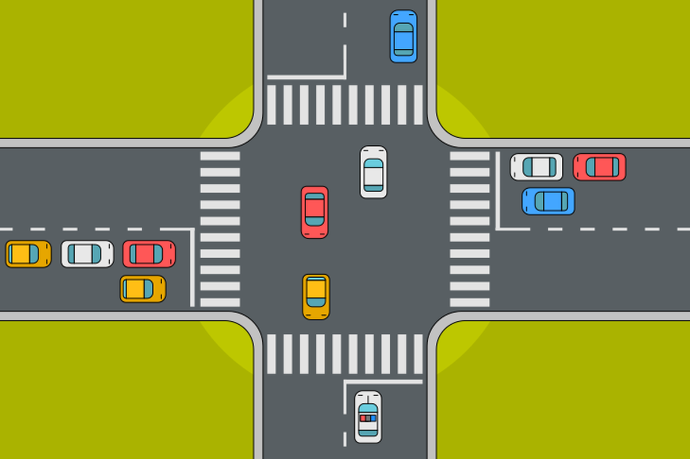

# Traffic Flow Simulation Project

## Overview

For this project, I will be provided with a significant amount of code to start with. This is very different from previous projects where I might be given only function prototypes, and I would essentially be starting from scratch. The provided classes and code will allow me to avoid spending too much time on high-level design, but I will need to spend some time understanding the provided code and how the code I will be adding will work with it.

In general, this project should be less time-consuming compared to a "start from scratch" project, and will allow me to focus on the simulation aspects instead of spending too much time on file reading, error checking, or determining which attributes my `EventClass` should have. Since the end of the semester is quickly approaching, this approach provides a good opportunity to gain experience with an event-driven simulation, as well as working with someone else’s code—just as would be the case in a team-based environment.

This project involves the implementation of an event-driven simulation of traffic flow through a 4-way intersection managed by a traffic light. The simulation will include cars arriving at the intersection from all four directions, and the traffic light changing state throughout the simulation. At the end of the simulation, I will output some minimal statistics about the traffic flow.

# Traffic Flow Simulation Project

## Detailed Description

### Phase 1: Templated Data Structures
In **Phase 1**, I will modify some of the data structures developed in Project 4 to be **templated**. This means that these data structures will be associated with a generic data type using C++ templates, allowing them to store a variety of data types instead of just integers. Specifically, the following classes must be updated:
- `SortedListClass`
- `FIFOQueueClass`

Note that there is no need to modify or include the `LIFOStackClass` in this project, so it will not be required to be templated or included in the submission.

The goal is to ensure that these templated data structure classes match the design, names, and functional interface as developed in Project 4. I will not add new member functions, introduce new member variables, or alter the number or meaning of function parameters. The primary difference between the Project 4 and Project 5 versions of these classes will be the introduction of templates to support different data types.

Phase 1 involves minimal new code development, primarily focusing on modifying the data structures to be templated and developing test cases to ensure the updated data structures work with various data types. Exhaustive testing will be performed in this phase to ensure that the modified data structures work as expected.

### Phase 2: Event-Driven Simulation
Once the templated data structures are implemented and tested, I will proceed to **Phase 2**, which involves developing an event-driven simulation of traffic flow through a 4-way intersection controlled by a functioning traffic light. 

The core components of the simulation are:
1. **Event Class**: This will define the events (such as cars arriving at the intersection and traffic light state changes) in the simulation.
2. **Event List**: The events will be stored in a `SortedListClass`, referred to as the "event list". This list will only contain events that are scheduled to occur in the future; events that have already been handled will not be stored.
   
The simulation will proceed by advancing through "time tics", which represent a generic unit of time. The definition of a "time tic" is unit-less, allowing for flexible scaling of the simulation. For example, a "time tic" could represent 1 second, 1 minute, or 1 millisecond, depending on the user’s preference.

#### Concept of Time Tics
A **time tic** represents a unit-less measure of time, making the simulation scaleable. When a simulation event occurs in "3 time tics", it means that the event happens after 3 advancements of time, but the exact unit of time (seconds, milliseconds, etc.) can vary depending on the user's settings.

### Simulation Parameters and Input File Format
The simulation will require 15 control parameters to function. These parameters will be read from a text file, whose name will be provided to the program via a command line argument. Below are the control parameters:

1. **Random Number Generator Seed**: A non-negative integer value to seed the random number generator for selecting a pseudo-random sequence in the simulation.
2. **Simulation End Time**: A positive integer indicating the time at which the simulation should end. Events occurring after this time will not be handled.
3. **East-West Green and Yellow Times**: Two positive integers indicating the duration of green and yellow lights for east-west traffic flow.
4. **North-South Green and Yellow Times**: Two positive integers indicating the duration of green and yellow lights for north-south traffic flow.
5. **Arrival Rate for East-Bound Cars**: Mean and standard deviation for the arrival rate of cars traveling east.
6. **Arrival Rate for West-Bound Cars**: Mean and standard deviation for the arrival rate of cars traveling west.
7. **Arrival Rate for North-Bound Cars**: Mean and standard deviation for the arrival rate of cars traveling north.
8. **Arrival Rate for South-Bound Cars**: Mean and standard deviation for the arrival rate of cars traveling south.
9. **Percentage of Drivers Advancing Through Yellow Light**: An integer between 0 and 100 indicating the percentage of drivers who will advance through a yellow light.

The input file format will be a simple ASCII text file where these 15 values are provided in a whitespace-delimited format. The parameters should be in the exact order listed above.

#### Example Input File
An example input file containing the 15 simulation control parameters might look like this: 
**12345** 
**1000**  
**10 2**  
**17 3**  
**3 1.04**  
**15 2.7**  
**7.25 0**  
**12.5 3.3**  
**65** 
For my traffic flow simulation, the input file is structured with several key parameters. The random number seed is set to 12345 to ensure reproducibility across different simulation runs. The simulation will run until the simulation clock reaches 1000 time tics. The east-west traffic light will remain green for 10 time tics and yellow for 2 time tics, while the north-south traffic light will stay green for 17 time tics and yellow for 3 time tics. Cars will arrive at the intersection from different directions according to normal distributions: east-bound cars will arrive with a mean of 3 time tics and a standard deviation of 1.04, west-bound cars will arrive with a mean of 15 time tics and a standard deviation of 2.7, north-bound cars will arrive with a mean of 7.25 time tics and a standard deviation of 0 (indicating no variation), and south-bound cars will arrive with a mean of 12.5 time tics and a standard deviation of 3.3. Additionally, on average, 65% of drivers will choose to advance through the intersection when the light is yellow. This setup defines the traffic light cycles, car arrival rates, and driver behavior, ensuring that the simulation accurately models traffic flow and decision-making at an intersection under different conditions.

# Event Handling Overview

The most important part of an event-driven simulation is the handling of events. As discussed in the lecture, handling an event often generates additional events that are scheduled to occur in the future. Additionally, handling an event changes the state of the simulation, such as advancing the simulation's "current time" to the time when the event occurs, and updating accumulating statistics (like maximum values, counts of objects, etc.).

To simplify our simulation, cars will only advance through an intersection when the light is changing. Although this is not realistic—cars typically advance through an intersection while the light is green or yellow—we will handle it differently for simplicity. Specifically, when the light changes to yellow in the north-south direction, we will advance up to 10 cars in the north-bound queue and up to 10 cars in the south-bound queue. This simulates that all cars waiting to pass through the intersection during the green light will already be in the queues when the light turns yellow. This approach simplifies the processing. Similarly, when the light changes from yellow in the north-south direction to green in the east-west direction, we will advance cars in the north-south direction during the yellow light change.

## Light Cycle

The light will always start as green in the east-west direction. The traffic light cycles as follows:

| Current Light State                            | Changed Light State                        | Cars Advancing During Change Event Handling   |
|------------------------------------------------|--------------------------------------------|-----------------------------------------------|
| Green East-West (Red North-South)              | Yellow East-West                           | East-West traffic through green light         |
| Yellow East-West (Red North-South)             | Green North-South                          | East-west traffic through yellow light        |
| Green North-South (Red East-West)              | Yellow North-South                         | North-south traffic through green light       |
| Yellow North-South (Red East-West)             | Green East-West                            | North-south traffic through yellow light      |

When advancing cars through a green light, cars advance one per time-tic. A green light lasting for 20 time-tics will allow up to 20 waiting cars in both directions to advance. During a yellow light, some drivers will advance through the light while others will stop. In our simulation, we will use a uniform random number to determine whether a driver advances. For example, if 75% of drivers are expected to advance, we can simulate this by comparing a random number to 75. Drivers who decide to stop will block the cars behind them.

## Event Handling Specifics

There are 8 types of events in our simulation:

1. **Car Arrival East-bound (EVENT_ARRIVE_EAST)**: When a car arrives heading east, it is added to the east-bound queue. The next east-bound arrival is scheduled based on the arrival distribution.
2. **Car Arrival West-bound (EVENT_ARRIVE_WEST)**: Same as the east-bound arrival, but for west-bound cars.
3. **Car Arrival North-bound (EVENT_ARRIVE_NORTH)**: Same as the east-bound arrival, but for north-bound cars.
4. **Car Arrival South-bound (EVENT_ARRIVE_SOUTH)**: Same as the east-bound arrival, but for south-bound cars.
5. **Light Change from Green East-West to Yellow East-West (EVENT_CHANGE_YELLOW_EW)**: When the light changes from green to yellow in the east-west direction, up to 10 cars from the east-bound and west-bound queues advance through the intersection.
6. **Light Change from Yellow East-West to Green North-South (EVENT_CHANGE_GREEN_NS)**: Advance cars during the yellow light for east-west traffic, then schedule the next light change to green in the north-south direction.
7. **Light Change from Green North-South to Yellow North-South (EVENT_CHANGE_YELLOW_NS)**: Advance cars through the intersection for the green light in the north-south direction, then schedule the next light change to yellow in the north-south direction.
8. **Light Change from Yellow North-South to Green East-West (EVENT_CHANGE_GREEN_EW)**: Advance cars during the yellow light in the north-south direction, then schedule the next light change to green in the east-west direction.

## Design and Provided Code

### EventClass
I will provide most of the `EventClass` for you to use in your project. Since objects of the `EventClass` will be stored in a `SortedListClass`, you will need to overload the necessary operators to work with the templated type in the `SortedListClass`. Events are sorted by their scheduled time, so events scheduled at earlier times are handled first.

### CarClass
The `CarClass` is provided to maintain data about a car participating in the simulation. It includes a unique identifier, the direction the car is heading, and the time at which it arrived at the intersection.

### IntersectionSimulationClass
This is the primary class for the project. It will manage simulation parameters, advance the simulation state, and maintain statistics. The `IntersectionSimulationClass` will contain the event list, as well as queues for the vehicles waiting to pass through the intersection.

I will provide part of the `IntersectionSimulationClass` that includes the class attributes, functionality to read simulation parameters, and print final statistics. You will need to add the event handling logic and maintain statistics.

### constants.h
I will provide predefined constants for the project. You can add more constants if needed, though the provided constants should suffice.

### random.h and random.cpp
These files contain functions to generate random numbers using uniform or normal distributions. You should use them as provided and not modify them.

### project5.cpp
The `project5.cpp` file contains the main function for the project. It is provided for you, and you should not need to modify it, but you can make minor adjustments if necessary. If you need to make major changes, consult the course staff to ensure the design is appropriate.

## Things NOT to Worry About

This project simplifies several real-world factors to focus on event-driven simulation concepts:

- **Driver reaction times**: We assume that one car passes through the intersection in exactly one time-tic.
- **Drivers who don't follow the rules**: All drivers stop at a red light.
- **Turns**: The intersection does not allow turns, simplifying the simulation.
- **Turn lights**: No left or right turn lights are needed.
- **Malfunctions**: The traffic light never malfunctions.
- **Red in both directions**: We don't need to handle the case where both directions are red simultaneously, as the simulation assumes one direction is always green.
- **Other blockages**: The intersection is never blocked by construction, emergency vehicles, etc.

